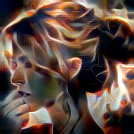

# Universal Style Transfer

This project is based on the paper [Universal Style Transfer via Feature Transforms.](https://arxiv.org/pdf/1705.08086.pdf) and our target is to reproduce the algorithm. The key idea is to train a encoder(Vgg-19 in this project and we use a pre-trained one) to extract features and build a 4 different level decoders to reconstruct the image. Between the encoder and the decoders we apply a WCT layer in order to: 1)implement SVD on original content and style images; 2)whitening and coloring; 3)reconstruct the image with blended features depending on parameter alpha.

## Samples

 

 

 

   
 
  
 ## 
